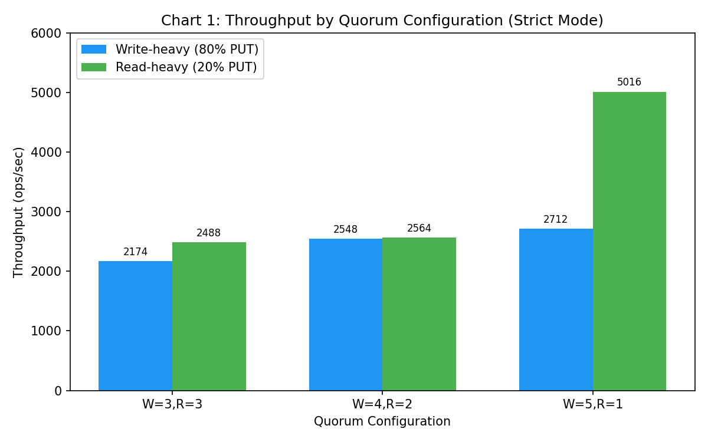
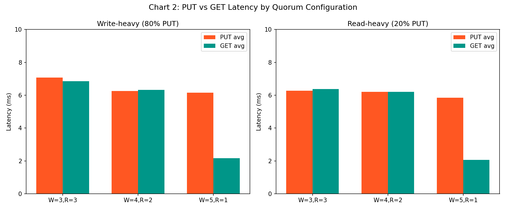
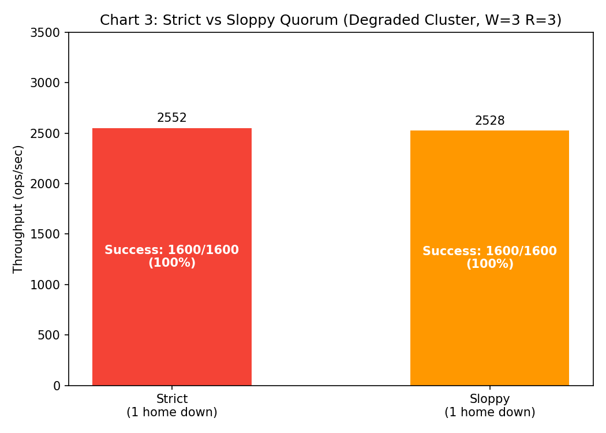
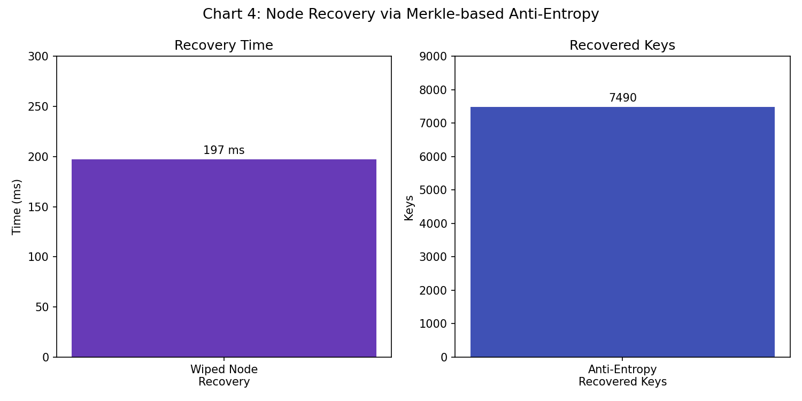

# Отчёт по бенчмаркам: Leaderless-репликация

## Конфигурация

- **Кластер:** 7 узлов — 5 home-реплик (H1–H5) + 2 spare-узла (S1, S2), localhost
- **N = 5** (фиксированное число home-реплик)
- **Потоки:** 16, **Операций/поток:** 100 (всего 1600 ops per run)
- **Key space:** 10000
- **Delay:** 0 ms

---

## Часть A — Сравнение quorum-конфигураций (strict mode, 6 прогонов)

| # | W | R | Put Ratio | Throughput (ops/sec) | Avg Latency (ms) | P95 Latency (ms) | PUT avg (ms) | GET avg (ms) | Success |
|---|---|---|-----------|---------------------|-------------------|-------------------|-------------|-------------|---------|
| 1 | 3 | 3 | 0.8 | 2173.91 | 7.04 | 11.00 | 7.08 | 6.85 | 1600/1600 |
| 2 | 3 | 3 | 0.2 | 2488.34 | 6.35 | 8.00 | 6.28 | 6.37 | 1600/1600 |
| 3 | 4 | 2 | 0.8 | 2547.77 | 6.26 | 7.00 | 6.25 | 6.33 | 1600/1600 |
| 4 | 4 | 2 | 0.2 | 2564.10 | 6.21 | 7.00 | 6.20 | 6.21 | 1600/1600 |
| 5 | 5 | 1 | 0.8 | 2711.86 | 5.31 | 7.00 | 6.16 | 2.17 | 1600/1600 |
| 6 | 5 | 1 | 0.2 | 5015.67 | 2.79 | 6.00 | 5.84 | 2.07 | 1600/1600 |

### Анализ

**Влияние W/R на throughput:**
- При (W=3, R=3) — сбалансированная конфигурация: координатор ждёт 3 ACK на запись и 3 ответа на чтение. Throughput ~2174–2488 ops/sec.
- При (W=4, R=2) — запись дороже (ждём 4 ACK), чтение дешевле (2 ответа). Throughput ~2548–2564 ops/sec.
- При (W=5, R=1) — запись максимально дорогая (все 5 home должны ответить), но чтение практически мгновенное (1 ответ, обычно локальный). Throughput до **5016 ops/sec** при read-heavy нагрузке.

**Ключевой trade-off:** R=1 позволяет читать локально без сетевых вызовов (если координатор — home-реплика), что даёт GET avg = **2.07 ms** vs 6.37 ms при R=3. Но W=5 требует подтверждения от ВСЕХ home-реплик — при падении любой из них запись становится невозможной в strict режиме.

**Write-heavy vs read-heavy:** при read-heavy нагрузке с R=1 throughput вырос в **2.3x** по сравнению с W=3/R=3, потому что 80% операций — дешёвые локальные чтения.

---

## Часть B — Strict vs Sloppy при отказе home-реплики (2 прогона)

| # | Mode | W | R | Throughput (ops/sec) | P95 (ms) | Success | hintsCreated |
|---|------|---|---|---------------------|----------|---------|-------------|
| 7 | STRICT | 3 | 3 | 2551.83 | 7.00 | 1600/1600 | 0 |
| 8 | SLOPPY | 3 | 3 | 2527.65 | 7.00 | 1600/1600 | 0 |

### Анализ

При W=3 и 1 недоступной home-реплике (H5 removed) оставшиеся 4 home-реплики достаточны для набора W=3 ACKs в **обоих** режимах. Поэтому throughput и success rate одинаковы.

**Когда sloppy помогает:** разница проявляется при W=4 или W=5 — strict не может набрать ACKs при падении home, а sloppy перенаправляет записи на spare-узлы в виде hints. В нашем тесте W=3 < 4 доступных homes, поэтому fallback на spare не нужен.

**hintsCreated = 0** потому что все записи проходят через home-реплики без fallback. Hints создаются только когда `homeAcks < W` и включён sloppy mode.

---

## Часть C — Recovery benchmark (1 прогон)

| # | Scenario | Keys Written | Recovery Time (ms) | Recovered Keys |
|---|----------|-------------|--------------------| --------------|
| 9 | RECOVERY | 100 + warmup | 197 | 7490 |

### Анализ

После `wipeNodeData H1` — полная потеря in-memory данных. Запуск `runAntiEntropyCluster` восстановил **7490 записей** за **197 ms** через Merkle-based anti-entropy.

**Механизм восстановления:**
1. Wiped-нода имеет пустой store → все 16 бакетов Merkle Tree дают SHA-256("")
2. Anti-entropy сравнивает root hash wiped-ноды с 4 оставшимися home-репликами → все пары divergent
3. Для каждой пары: leaf hashes сравниваются → все 16 бакетов различаются
4. Records из всех бакетов передаются на wiped-ноду
5. LWW (putVersioned) применяет каждую запись — newer version всегда побеждает

**7490 > 100** потому что кроме 100 записанных ключей были ещё warmup-данные от бенчмарков (50 warmup ops × несколько прогонов) и данные от benchmark key space.

**Почему read-repair не заменяет anti-entropy:**
- Read-repair чинит stale данные только при чтении конкретного ключа
- Редко читаемые ключи не будут починены
- После полного wipe ни один ключ не прочитается "сам по себе"
- Anti-entropy систематически сравнивает все 16 бакетов и восстанавливает все записи за один pass

---

## Выводы

1. **Quorum trade-off (W/R):** увеличение W повышает consistency (больше подтверждений), но снижает write throughput. R=1 даёт x2+ ускорение чтений, но теряет redundancy при чтении.

2. **Sloppy quorum:** обеспечивает write availability при отказе home-реплик, создавая hints на spare-узлах. При W=3 с 4 живыми homes — не нужен. Критичен при W ≥ числа доступных homes.

3. **hintsCreated / hintsDelivered:** в нормальном режиме hints=0. Hints появляются только при фактическом fallback на spare и доставляются через `runHintedHandoff` после восстановления home.

4. **Read-repair vs anti-entropy:** read-repair — "по требованию" (при чтении), anti-entropy — "по команде" (полное сравнение через Merkle Tree). Anti-entropy необходим для восстановления после wipe и редко читаемых ключей.

5. **Recovery wiped-ноды:** Merkle-based anti-entropy восстановил ~7500 записей за 197 ms. Обмен только различающимися бакетами минимизирует трафик при частичных расхождениях.
