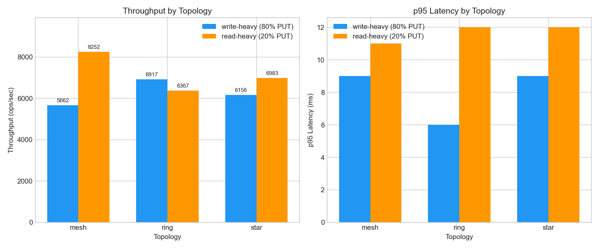
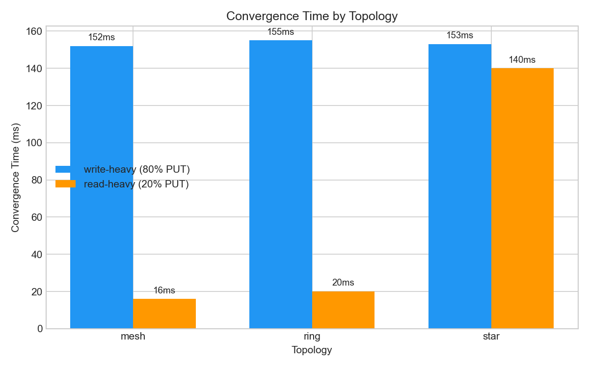
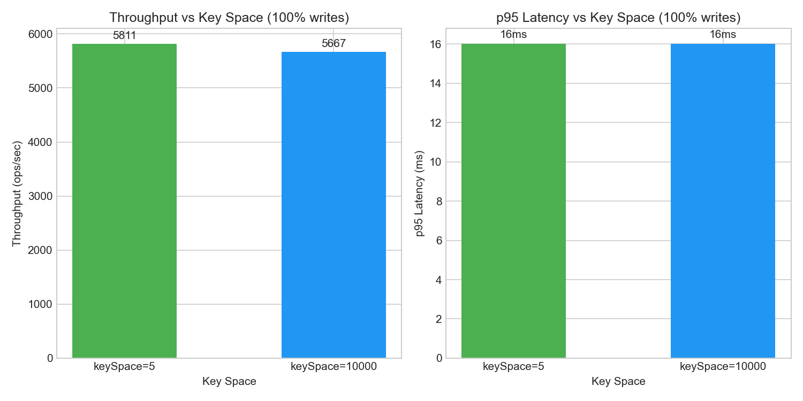
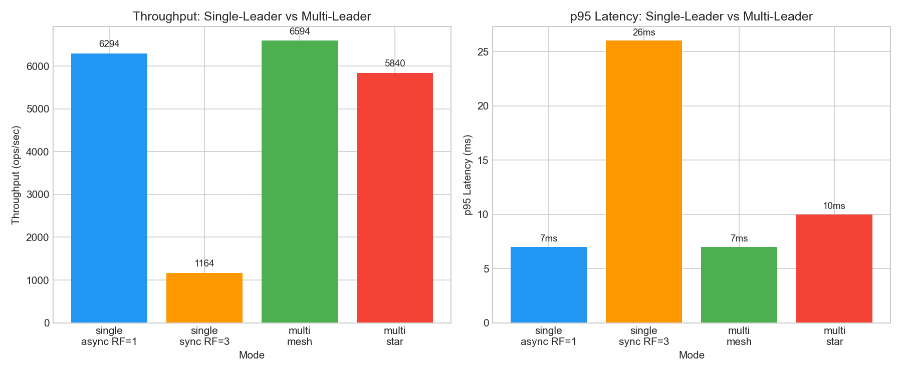

# Отчёт по бенчмаркам: Multi-Leader Replication

## Конфигурация

- **Кластер:** 10 узлов — 4 лидера + 6 фолловеров, localhost
- **Разрешение конфликтов:** LWW (Lamport Clock + nodeId)
- **Задержка репликации:** 0 ms
- **Дедупликация:** по `operationId`, TTL 5 мин

---

## Часть A — сравнение топологий

**Параметры:** 200 000 операций, 16 потоков, keySpace=10 000

| Топология | Нагрузка | Throughput (ops/sec) | avg (ms) | p50 (ms) | p75 (ms) | p95 (ms) | p99 (ms) | Convergence (ms) |
|-----------|----------|---------------------|----------|-----------|----------|-----------|----------|-------------------|
| mesh      | 80% PUT  | 5 663               | 2.7      | 1         | 2        | 9         | 28       | 152               |
| mesh      | 20% PUT  | 8 253               | 1.7      | 1         | 1        | 11        | 14       | 16                |
| ring      | 80% PUT  | 6 917               | 2.2      | 2         | 3        | 6         | 12       | 155               |
| ring      | 20% PUT  | 6 368               | 2.3      | 1         | 1        | 12        | 15       | 20                |
| star      | 80% PUT  | 6 157               | 2.3      | 1         | 2        | 9         | 18       | 153               |
| star      | 20% PUT  | 6 983               | 2.0      | 1         | 1        | 12        | 14       | 140               |

### Анализ

**Почему mesh быстрее по схождению, но дороже по сети:**
Mesh при read-heavy сходится за 16 мс (один хоп до всех узлов), ring — 20 мс, star — 140 мс. Но каждый PUT в mesh порождает O(N) сообщений (лидер рассылает всем 9 узлам), тогда как ring — O(1) от каждого узла. При write-heavy mesh показывает 5 663 ops/sec — ниже ring (6 917), именно потому что лидер тратит ресурсы на 9 отправок вместо одной.

**Почему ring медленнее и чувствителен к разрыву:**
Ring передаёт обновление по цепочке: каждый узел пересылает следующему. Схождение требует O(N) хопов. При падении узла без `removeNode` цепочка рвётся — обновления перестают доходить до узлов за точкой разрыва.

**Почему star создаёт bottleneck:**
Все сообщения проходят через центральный узел. При read-heavy convergence = 140 мс (vs 16 мс у mesh) — центр перегружается маршрутизацией. Центральный узел = SPOF: при его остановке репликация прекращается.

---

## Часть B — влияние конфликтности

**Параметры:** 400 000 операций, 32 потока, 100% PUT, mesh

| Key Space | Throughput (ops/sec) | avg (ms) | p50 (ms) | p75 (ms) | p95 (ms) | p99 (ms) | Convergence (ms) |
|-----------|---------------------|----------|-----------|----------|-----------|----------|-------------------|
| 5         | 5 811               | 5.3      | 3         | 4        | 16        | 66       | 140               |
| 10 000    | 5 667               | 5.4      | 2         | 4        | 16        | 69       | 158               |

### Анализ

**Почему multi-leader даёт несколько точек записи, но создаёт конфликты:**
4 лидера принимают PUT параллельно. При keySpace=5 и 32 потоках один и тот же ключ обновляется с разных лидеров почти одновременно — возникают конфликтующие версии с одинаковым lamport. LWW разрешает их детерминированно через tie-break по nodeId. Разница в throughput между keySpace=5 и 10 000 составляет ~2.5% — `ConcurrentHashMap.compute()` атомарна и O(1), overhead от конфликтов минимален.

---

## Часть C — single-leader vs multi-leader

**Параметры:** 200 000 операций, 16 потоков, putRatio=0.8, keySpace=10 000

| Режим              | Throughput (ops/sec) | avg (ms) | p50 (ms) | p75 (ms) | p95 (ms) | p99 (ms) |
|--------------------|---------------------|----------|-----------|----------|-----------|----------|
| single, async RF=1 | 6 295               | 2.5      | 2         | 3        | 7         | 12       |
| single, sync RF=3  | 1 164               | 13.6     | 15        | 16       | 26        | 32       |
| multi, mesh        | 6 595               | 2.2      | 1         | 2        | 7         | 19       |
| multi, star        | 5 840               | 2.4      | 1         | 2        | 10        | 17       |

### Анализ

**Где выигрывает multi-leader:**
Multi-leader mesh (6 595 ops/sec) на 5% быстрее single async (6 295) — 4 лидера распределяют нагрузку записи, устраняя bottleneck единственного лидера. P50 снижается с 2 мс до 1 мс.

**Где выигрывает single-leader:**
Single sync RF=3 даёт строгую консистентность — данные гарантированно на всех репликах до ответа клиенту. Multi-leader обеспечивает только eventual consistency. Цена строгой консистентности — throughput падает в 5.7x (1 164 ops/sec), p95 = 26 мс.

---

## Выводы

| Критерий | Single-leader | Multi-leader |
|----------|---------------|--------------|
| Консистентность | Сильная (sync) или eventual (async) | Только eventual |
| Throughput записи | Ограничен одним узлом | Масштабируется с числом лидеров |
| Конфликты | Невозможны | Возможны, разрешаются LWW |
| Отказоустойчивость записи | Лидер = SPOF | Запись доступна при падении части лидеров |

1. **Mesh** — максимальная скорость схождения, но O(N) сообщений на запись.
2. **Ring** — минимальный трафик, но O(N) хопов и уязвим к разрыву.
3. **Star** — предсказуемая маршрутизация, но центр = SPOF и bottleneck.
4. **LWW + Lamport Clock** — разрешает конфликты с минимальным overhead.
5. **Single-leader** выигрывает при необходимости строгой консистентности, **multi-leader** — при высокой нагрузке на запись.
